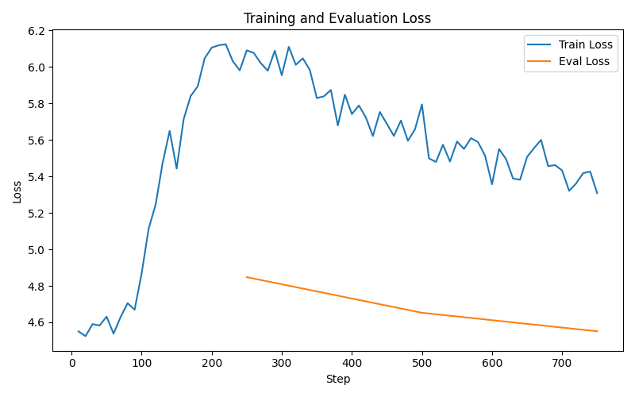

# llm-finetune
Basic LLM fine-tuning

<figure>
    
    <figcaption>Figure 1: Loss Curve.</figcaption>
</figure>

Training and Evaluation Loss (TBD)
- Consider changing learning rate, weight decay, batch size, and dropout to stabilize curves.
- Confirm x-axis
